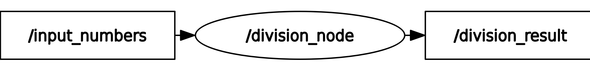
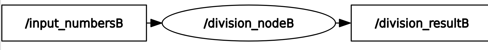
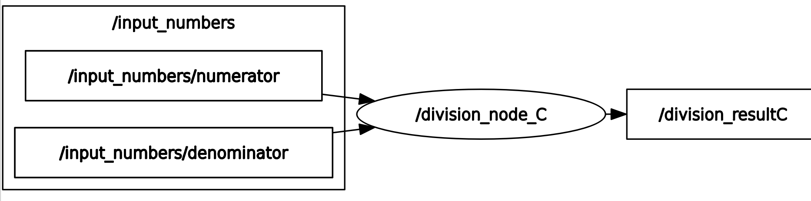

# ROS2 Division Nodes

Dependencies: ROS 2 (Humble), rclcpp, std_msgs,

## Build Instructions

Ensure you have ROS 2 installed and properly set up.

Create a workspace and build the project:

	mkdir -p ~/ros2_ws/src
	cd ~/ros2_ws/src
	git clone https://github.com/petomartin/QLM_homework.git
	cd ~/ros2_ws
	colcon build --symlink-install

This project consists of three different ROS2 nodes that perform division operations in various formats. These nodes subscribe to specific topics, receive two numbers (numerator and denominator), and publish the result of the division. The nodes handle potential errors, such as division by zero.

This project implements three ROS2 nodes:

### division_node: 
Receives individual numbers (numerator and denominator) one at a time and performs division. The division_node subscribes to a single topic, /input_numbers, to receive both the numerator and denominator values. These values are provided sequentially, and the node performs division when both values have been received.

Starting the Node:

    ros2 run homework_package division_node
The recommended best practice is to send the numbers one by one in a single tab using the following command:

    ros2 topic pub -1 /input_numbers std_msgs/msg/Float64 "{data: 12.0}"
    ros2 topic pub -1 /input_numbers std_msgs/msg/Float64 "{data: 4.0}"
Viewing the Result:

    ros2 topic echo /division_result

### division_node_B: 
The division_node_B subscribes to the /input_numbersB topic, where it listens for two numbers (numerator and denominator) 
packaged into a Float64MultiArray message. This node then performs division once both numbers are received, and publishes the result to the /division_resultB topic.

Starting the Node:

    ros2 run homework_package division_node_B
Adding values:

    ros2 topic pub /input_numbersB std_msgs/msg/Float64MultiArray "data: [10.0, 2.0]"

    
Viewing the Result:

    ros2 topic echo /division_resultB

### division_node_C:
The division_node_C subscribes to two separate topics: one for the numerator (/input_numbers/numerator) and one for the denominator (/input_numbers/denominator). 
The node performs division when both the numerator and denominator are received, and it publishes the result to the /division_resultC topic.

Starting the Node:

    ros2 run homework_package division_node_C

To send the numerator:

    ros2 topic pub /input_numbers/numerator std_msgs/msg/Float64 "{data: 10.0}"

To send the denominator:

    ros2 topic pub /input_numbers/denominator std_msgs/msg/Float64 "{data: 2.0}"

Viewing the Result:

    ros2 topic echo /division_resultC

